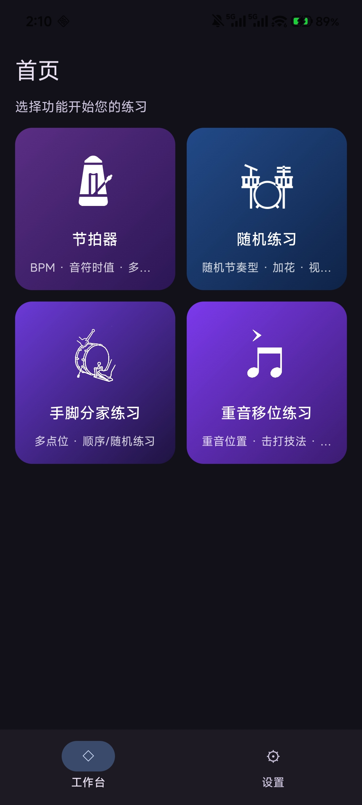
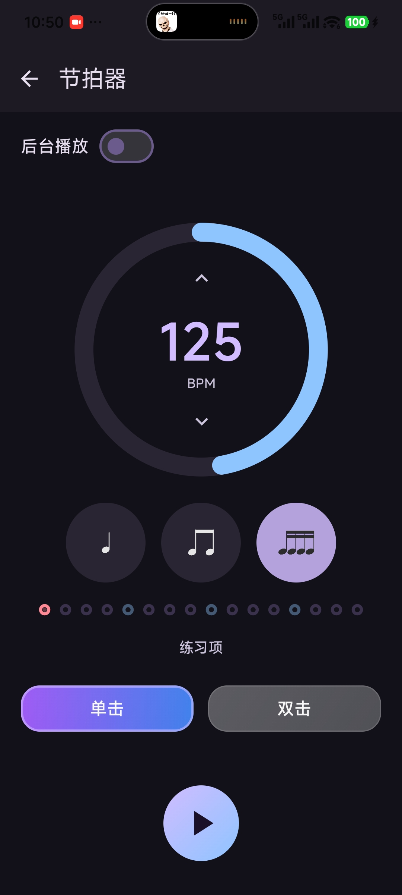
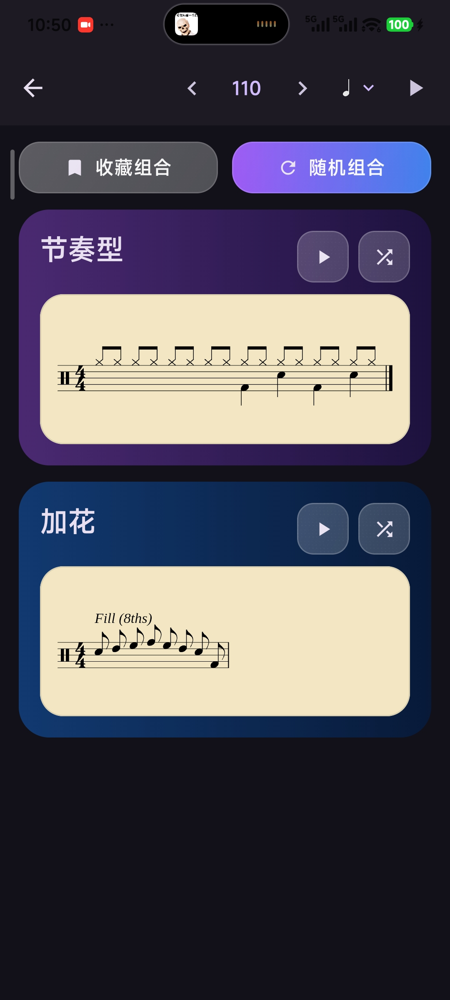
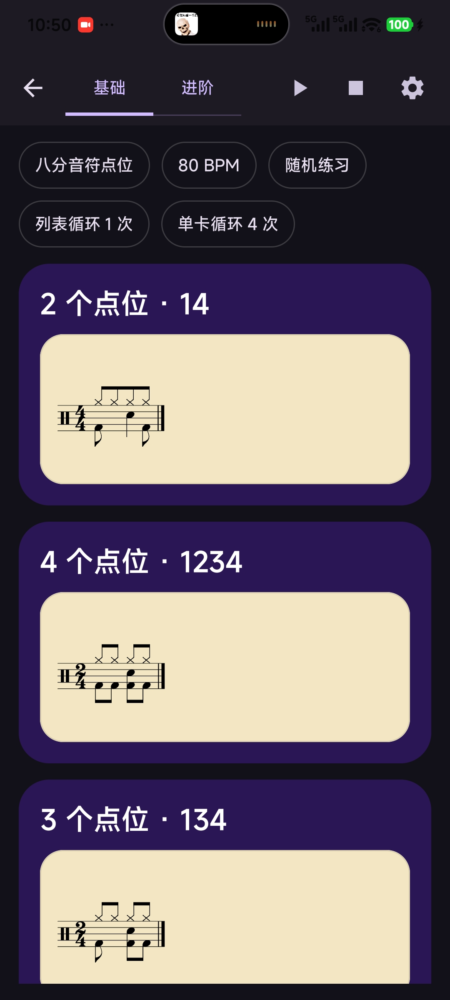
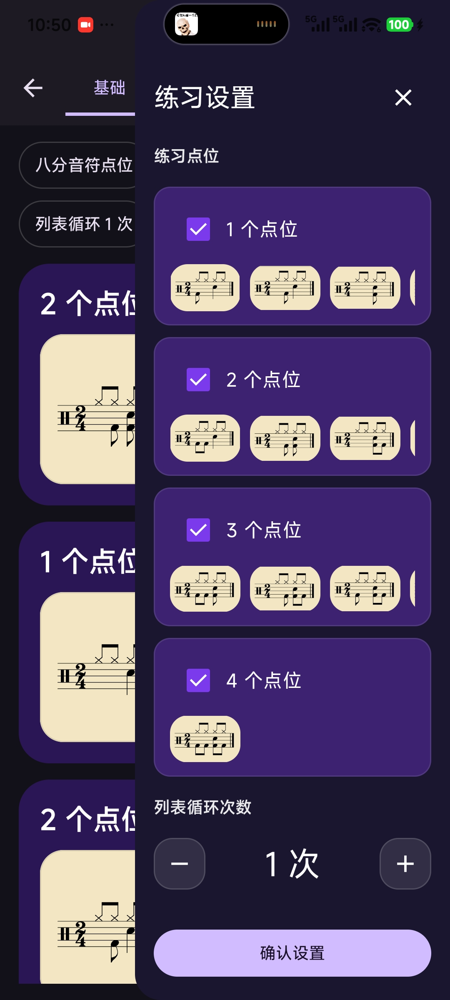
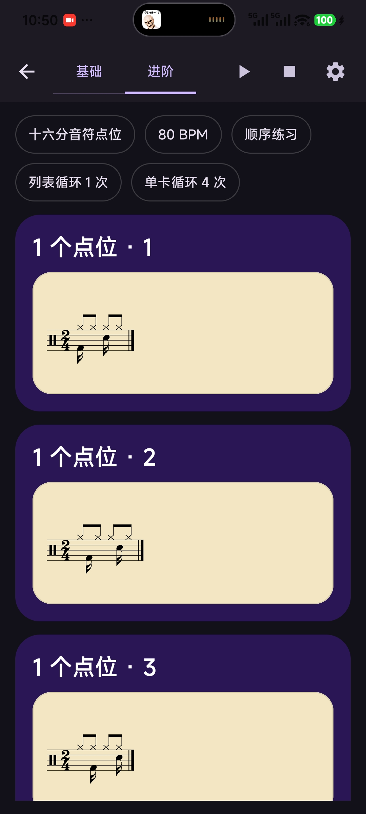
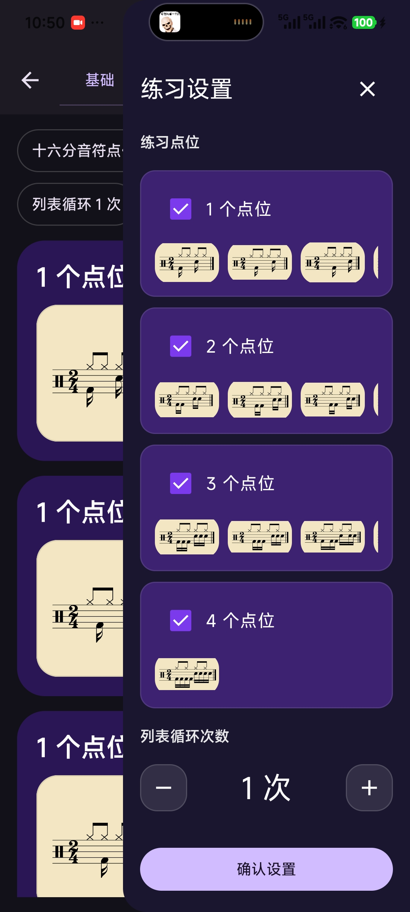
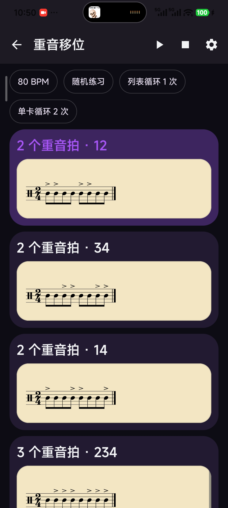
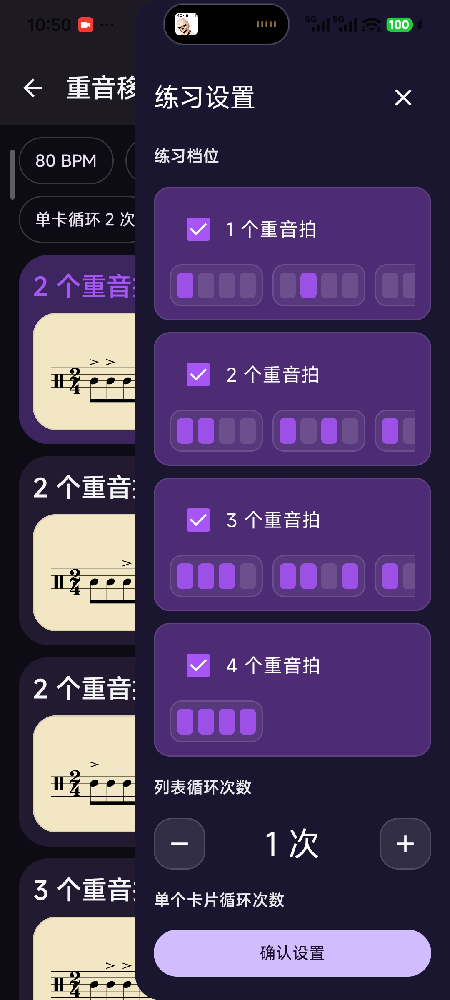
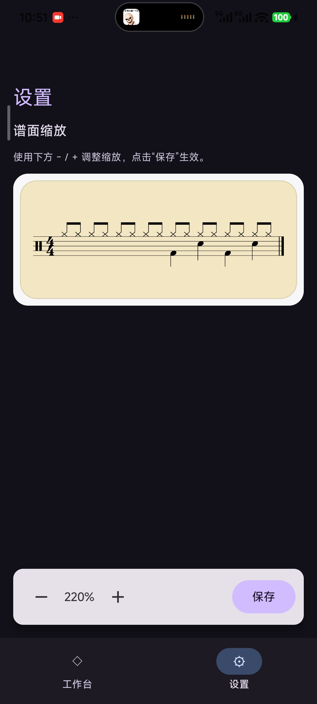

# DrumHero
一款离线架子鼓基础练习App

Kotlin Multiplatform + Compose Multiplatform 的离线鼓练习工具骨架：Android、Desktop（JVM）；IOS暂不支持。

下载：[Download](https://github.com/cozy-fire/drum-practice/releases)

## 功能介绍（按工作台顺序）

|                                                               | 功能说明 |
|---------------------------------------------------------------|---|
|  | 工作台预览 |

### 1) 节拍器

- 支持 BPM 调整、分拍（1/2/4）、强弱拍提示、音色选择

|  | 功能说明 |
|---|---|
|  | 节拍器包含 BPM、音色、拍型调整 |

### 2) 随机练习

- 随机生成练习组合，支持 BPM / 分拍设置与练习播放

|  | 功能说明 |
|---|---|
|  | 随机练习会提供不同的节奏型 + 加花卡片，旨在锻炼基础视奏能力 |

### 3) 手脚分家练习

- 手脚分家练习通过隔离手部与腿部动作，将八分/十六分点位所有常见单词都纳入练习范围，该功能旨在锻炼手脚是否可以做到隔离控制

|  | 功能说明 |
|---|---|
| <table><tr><td></td><td></td></tr></table> | 基础模式：八分音符点位练习 |
| <table><tr><td></td><td></td></tr></table> | 进阶模式：十六分音符点位练习 |

### 4) 重音移位练习

- 锻炼 Full、Down、Tap、Up 击打技巧

|  | 功能说明 |
|---|---|
| <table><tr><td></td><td></td></tr></table> | 提供 15 个重音点位分布节奏的随机/顺序练习 |

### 5) 设置页

- 配置应用相关偏好与练习显示参数

|  | 功能说明 |
|---|---|
|  | 应用全局设置 |
