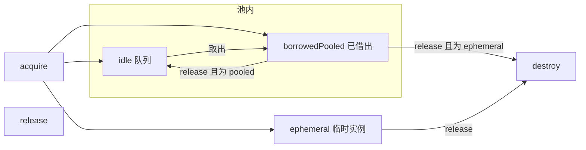

# WebView 池化与预热方案

本文描述 Android 端 **Verovio 五线谱** 所用 `WebView` 的 **Application 级对象池** 与 **预热** 行为，与代码 `VerovioWebViewPool`、`DrumApplication`、`MusicXmlScoreScreen.android.kt` 保持一致。

## 目标

- **降低冷启动进谱面页的等待**：进程启动后异步预热 1 个已配置好的 `WebView`，并载入最小 HTML 壳，减少首次 `acquire` 时的创建与首帧成本。
- **复用实例**：离开谱面页时将 `WebView` 归还池中（在容量与策略允许时），再次进入时优先从 idle 队列取出。
- **控制内存**：idle 实例带 **TTL**；系统 **低内存** 时清空 idle；池满时 **不落池** 的临时实例在 `release` 时 **直接 destroy**。

## 接入位置

| 环节 | 说明 |
|------|------|
| `DrumApplication.onCreate` | `VerovioWebViewPool.install(this, applicationScope)`，随后 `prewarmAsync()`。 |
| `MusicXmlScoreScreen`（Android） | `AndroidView(factory = { VerovioWebViewPool.acquire() }, update = { loadDataWithBaseURL(...) }, onRelease = { VerovioWebViewPool.release(it) })`。 |

`install` 会注册 `ComponentCallbacks2`，在 `onTrimMemory` ≥ `TRIM_MEMORY_RUNNING_CRITICAL` 时 **销毁全部 idle** `WebView`。

## 定标参数（代码常量）

| 名称 | 值 | 含义 |
|------|-----|------|
| `POOL_MAX_SIZE` | 3 | 池中 **idle + 已借出（pooled）** 合计上限相关的逻辑上限：`idle.size + borrowedPooled.size` 达到此值后，新请求走 **ephemeral**。 |
| `POOL_WARM_MIN` | 1 | 希望至少保持的「池内可用规模」下限；在 idle 被回收或 TTL 清掉后，异步补足到 `warm_min`（仍受 `POOL_MAX_SIZE` 约束）。 |
| `POOL_INITIAL_PREWARM` | 1 | 应用启动时 `prewarmAsync` 至少创建并放入 idle 的数量（若尚未达到且未触顶）。 |
| `IDLE_TTL_MS` | 300_000（5 分钟） | idle 超过此时长未再被借出则 **destroy** 并移出池。 |
| `IDLE_SWEEP_INTERVAL_MS` | 60_000 | 存在 idle 时，主线程 **周期性** 检查 TTL。 |

详细逻辑以 `composeApp/.../score/webview/VerovioWebViewPool.kt` 为准。

## 生命周期与状态

- **acquire（主线程）**  
  1. 若 `idle` 非空：取队头加入 `borrowedPooled`，返回该 `WebView`。  
  2. 否则若 `idle.size + borrowedPooled.size < POOL_MAX_SIZE`：新建 `WebView`，加入 `borrowedPooled`，返回。  
  3. 否则：新建 **ephemeral** 实例（仅加入 `ephemeralBorrowed`），返回。

- **release（主线程）**  
  - **ephemeral**：`destroy`，不入池。  
  - **borrowedPooled**：`resetForPool`（`loadDataWithBaseURL` 加载 **空白谱 HTML**：结构与谱面页一致，`<body>` 内为空的 `<svg xmlns=...>`，对应无内容谱面占位；非原生 MusicXML，因 WebView 仅展示已渲染的 SVG）后入 `idle` 队尾，记录 idle 时间；并可能触发 **warm_min** 补足。  
  - 已在 idle / 未知实例：按实现销毁或 no-op（见代码 `when` 分支）。

- **预热** `prewarmAsync()`：`applicationScope` + `Dispatchers.Main`，`yield()` 后执行；新建 `WebView` 并 `loadDataWithBaseURL(..., MINIMAL_HTML_SHELL, ...)` 再入 idle。`ensureWarmMinAsyncLocked` 补足时同样加载 **最小 HTML 壳**（`MINIMAL_HTML_SHELL`）。

## WebView 配置

- `WebView(appContext)`，`webViewClient = WebViewClient()`，`settings.javaScriptEnabled = false`（谱面仅为静态 SVG HTML，无需 JS）。
- **所有 `acquire` / `release` / 池内维护必须在主线程**（`checkMainThread()`）。

## 调试日志

- Tag：`DrumWebViewPool`，仅在 **debuggable 包** 或 `adb shell setprop log.tag.DrumWebViewPool DEBUG` 时输出 `Log.d`。
- 典型文案：`install`、`prewarm pooled`、`acquire hit_idle` / `miss_new_pooled` / `ephemeral`、`release to_idle`、`idle_ttl destroy`、`trimMemory critical idle_cleared` 等。

## 与「再进页面闪一下旧谱」的关系（ViewModel，非池逻辑）

池化会让 **同一 `WebView` 实例** 反复展示不同 `loadData` 内容；若 **Compose 首帧传入的 SVG 字符串** 与 **进程内共享 Verovio toolkit 当前加载的谱面** 不一致，会出现先错后对的闪烁。

当前约定：`VerovioScoreViewModel.initIfNeeded` 在绑定 **已存在的** `VerovioScoreRuntime` 共享 `toolkit` 时，用 **`verovioToolkit.renderToSVG(1)`** 初始化 `svgString`，**不再**使用进程启动时缓存的 `VerovioScoreRuntime.initialSvg` 快照。详见 `VerovioScoreViewModel.kt` 内注释。

## 后续可调方向（未实现）

- 预热仍使用无正文的 `MINIMAL_HTML_SHELL`；归还池使用 `BLANK_SCORE_HTML`（空 SVG）。若希望 idle 形态完全一致，可将预热也改为 `BLANK_SCORE_HTML`（略增 HTML 体积，可忽略）。
- 按产品策略微调 `POOL_MAX_SIZE`、`POOL_WARM_MIN`、TTL，并在低端机上观察内存与进页耗时。
