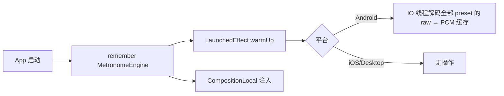
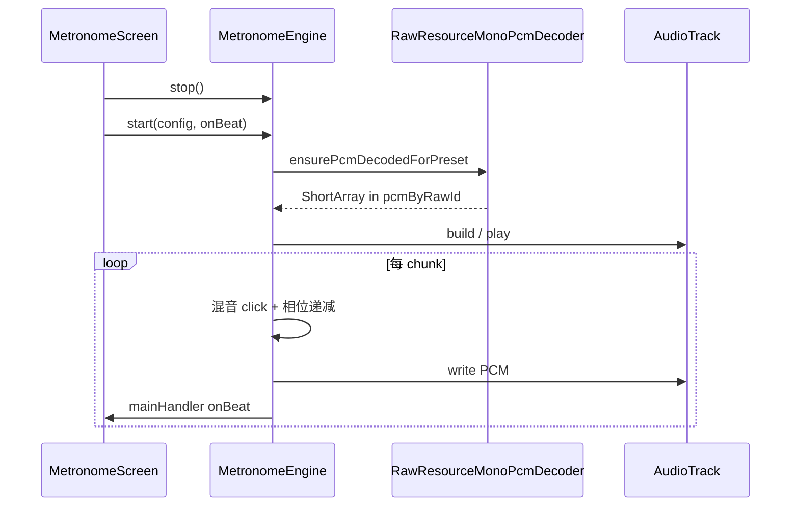
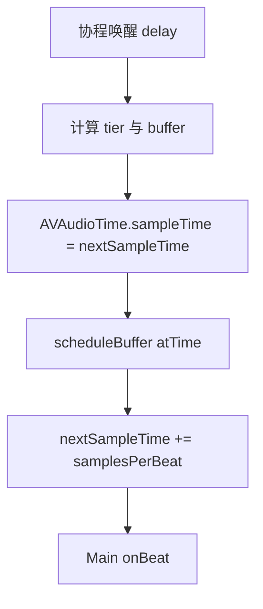

# DrumPractise 节拍器方案说明

本文档描述当前仓库内节拍器的**架构、计时模型、各平台实现差异**，并与市面常见做法对照；同时说明**音效资源命名、加载与播放链路**。文中路径均以仓库根目录 `DrumPractise/` 为基准（相对路径从根目录起算，例如 `composeApp/...`）。

---

## 1. 目标与范围

- **产品目标**：在 Android / iOS / Desktop（JVM）上提供可用的节拍器：BPM、分拍（1～4）、多种音色预设、强弱拍区分、与 Compose UI 同步的视觉节拍指示。
- **代码边界**（主要文件）：
  - 公共契约与算法：`composeApp/src/commonMain/kotlin/com/drumpractise/app/metronome/`
  - Android 实现：`composeApp/src/androidMain/kotlin/com/drumpractise/app/metronome/MetronomeEngine.android.kt`、`RawResourceMonoPcmDecoder.android.kt`
  - iOS 实现：`composeApp/src/iosMain/kotlin/com/drumpractise/app/metronome/MetronomeEngine.ios.kt`
  - Desktop 实现：`composeApp/src/desktopMain/kotlin/com/drumpractise/app/metronome/MetronomeEngine.desktop.kt`
  - 资源生成脚本（占位 WAV）：`scripts/generate_metronome_wavs.py`
- **注意**：仓库内另有 `shared/` 模块下的 `MetronomeEngine` 桩实现，与 `composeApp` 中实际业务无关；**以 `composeApp` 为准**。

---

## 2. 市面常见节拍器技术路线（概览）

下表为行业与开源应用中**高频出现**的方案，便于和本项目对照（不穷尽所有变体）。

| 路线 | 做法概要 | 优点 | 典型缺点 / 风险 |
|------|----------|------|-----------------|
| **系统定时器 + 高层播放器** | `Handler`/`Timer`/`NSTimer` 等到点再 `SoundPool`/`MediaPlayer`/`AVAudioPlayer` 播放 | 实现快、代码少 | 调度抖动大，BPM 高或设备忙时**漂移、不齐** |
| **协程 `delay` / `sleep` 驱动** | 每拍 `delay(间隔)` 后触发采样 | 逻辑直观 | 同样受线程与系统调度影响，**长期精度一般** |
| **音频时钟驱动（推荐方向）** | 以采样率为基准累计 `sampleTime`，用 `AudioTrack` 写 PCM 或在 `AVAudioPlayerNode` 上 `scheduleBuffer(atTime:)` | **节拍与声卡输出对齐**，听感稳 | 实现复杂，需处理缓冲、underrun、格式统一 |
| **合成音（Oscillator / 正弦）** | 每拍生成短促 beep 或直接调 API 发声 | 体积极小、无资源文件 | 音色单一；Desktop/Java 上易有延迟；与「真实采样」听感不一致 |
| **预渲染 PCM + 环形缓冲** | 启动时解码所有点击到内存，播放时只 memcpy/mix | 低 CPU、可预测 | 占内存；需统一采样率与声道 |
| **MIDI / 音序器** | 用 MIDI 时钟或 `MidiManager` 发 note | 可扩展为鼓组、课程 | 依赖 MIDI 栈与用户设备；节拍器常过度设计 |
| **专业低延迟栈** | AAudio、Oboe、Superpowered 等 | 延迟极低 | NDK/绑定成本，KMP 上集成更重 |

**结论（与项目选型相关）**：

- **Android**：当前实现采用 **「流式 AudioTrack + 在 PCM 域按采样间隔混音点击」**，属于「音频时钟驱动」一族，有利于节拍与输出设备对齐。
- **iOS**：采用 **AVAudioEngine + AVAudioPlayerNode + 按采样时间调度 buffer**，同样是音频时间轴思路，并用 `delay` 仅作「线程唤醒」辅助。
- **Desktop**：采用 **正弦波即时合成 + `Clip` 播放**，属于「合成音 + 定时器」一族，与移动端**不同源、不同听感**，但实现成本低。

---

## 3. 当前方案总览（跨平台）

### 3.1 公共数据模型

- **`MetronomeRunConfig`**：`bpm`（10～300）、`noteDivisor`（1～4）、`MetronomeSoundPreset`。
- **间隔计算**（`MetronomeRunConfig.kt`）：
  - 毫秒：`round(60000 / bpm / noteDivisor)`，至少 1 ms。
  - 纳秒：`round(60_000_000_000 / bpm / noteDivisor)`，至少 1 ns；**iOS/Android 上用于与采样率精确相乘**，避免「先取整毫秒再换算」的二次误差。
- **强弱拍**（`MetronomeAccent.kt`）：
  - `metronomeBeatPeriod(noteDivisor) = 4 * noteDivisor`，表示一个循环内的「拍位」数量（与 UI 圆环分段一致）。
  - `step = period / 4`，只在 `index % step == 0` 的位置发声为强或次强，其余为弱拍。
  - `index == 0` → `Strong`；同小节内其它对齐 `step` 的位置 → `Medium`；其余 → `Weak`。

### 3.2 引擎 API（`MetronomeEngine.kt`）

| 方法 | 作用 |
|------|------|
| `start(config, onBeat)` | 按配置启动循环；`onBeat(indexInPeriod, tier)` 每拍回调。 |
| `stop()` | 停止循环并释放平台播放资源（各平台细节不同）。 |
| `updateConfig(config)` | 运行中更新：内部会 **停止再 start**（Android 会重建 `AudioTrack` 循环）。 |
| `warmUp()` | **Android**：在 IO 线程预解码全部预设的 raw → PCM；**iOS/Desktop**：当前为空实现。 |
| `release()` | 停止线程/协程、清空缓存、断开音频图。 |

### 3.3 UI 与引擎协作（`MetronomeScreen.kt` + `App.kt`）

- `App` 中 `remember { MetronomeEngine() }`，并通过 `CompositionLocalProvider(LocalMetronomeEngine provides …)` 注入。
- 启动时 `LaunchedEffect(metronomeEngine) { metronomeEngine.warmUp() }`：**主要为 Android 预热解码**。
- `MetronomeScreen` 中 `LaunchedEffect(playing, bpm, noteDivisor, preset)`：先 `engine.stop()`，若 `playing` 为真则 `engine.start(MetronomeRunConfig(...), onBeat)`。  
  **含义**：任意参数变化都会 **整段重启** 节拍循环（与 `updateConfig` 的「热更新」路径不同；UI 当前未在运行中单独调用 `updateConfig`）。

---

## 4. Android：解码、缓冲与混音流程

### 4.1 设计要点

1. **资源**：`res/raw/` 下以 **`R.raw.*`** 引用的压缩音频（如 `.mp3`）或 WAV；运行时通过 **`MediaExtractor` + `MediaCodec`** 解码为 PCM。
2. **统一格式**：解码后 **转单声道 S16**，并用 **线性插值重采样到 48 kHz**（`METRONOME_PCM_SAMPLE_RATE`），与 `AudioTrack` 配置一致。
3. **播放**：`AudioTrack` **`MODE_STREAM`**，`PERFORMANCE_MODE_LOW_LATENCY`（API 26+），`USAGE_GAME` + `CONTENT_TYPE_SONIFICATION`，Android S+ 附加 **`FLAG_LOW_LATENCY`**。
4. **计时**：在 **音频线程** 内按 **采样点** 推进相位：`intervalSamples = 48000 * 60 / bpm / noteDivisor`。每写入一帧 PCM，`phaseUntilBeat` 减 1；当需要发声时，把对应 `ShortArray` 按 **tier 音量系数** 混入输出缓冲。

### 4.2 解码链路（`RawResourceMonoPcmDecoder.android.kt`）

```
openRawResourceFd(resId)
    → MediaExtractor 选音频轨
    → MediaCodec 解码输出 Buffer
    → 按 KEY_PCM_ENCODING 解析为 Short（支持 S16 / Float）
    → 多 chunk 拼接为交错 PCM
    → downmixToMono（多声道取平均）
    → resampleMonoLinear(原采样率 → 48000)
    → 存入 ConcurrentHashMap<Int, ShortArray>（key = rawResId）
```

- **线程安全**：`pcmByRawId` 为 `ConcurrentHashMap`；同一 `rawId` 仅 `computeIfAbsent` 解码一次。
- **失败**：解码失败时可能得到空数组；混音处对空数组有防护，表现为该拍静音。

### 4.3 播放线程内主循环（逻辑顺序）

1. `ensurePcmDecodedForPreset`：确保当前预设下三档 `MetronomeAccent` 对应 raw 均已解码。
2. 创建 `AudioTrack`，`bufferBytes = getMinBufferSize(...)`（**刻意使用系统允许的最小缓冲**以降低延迟，注释说明 underrun 风险）。
3. **预填静音**：写入若干 `0` 短数组，目标约为缓冲的 1/4～1/2 之间，平衡「首声延迟」与稳定性。
4. `track.play()`。
5. 循环（直到 `running == false`）：
   - 分配 `work` 缓冲（长度 `chunkSamples`，在 128～256 样本之间与缓冲容量相关）。
   - 对每个输出样本：若当前正在播放一段 click，则从 `clickPcm` 取样并乘 `clickVol`；同时若 `phaseUntilBeat <= 0`，则触发下一拍：取 tier、rawId、PCM、设置 `clickPos`、**`mainHandler.post { onBeat(...) }`**、`beat++`、`phaseUntilBeat += intervalSamples`。
   - `phaseUntilBeat -= 1.0`（每输出一个采样减一）。
   - `track.write(work)`。

**要点**：节拍间隔是 **浮点采样数**（`intervalSamples` 为 `Double`），长期累积由 `phaseUntilBeat` 承载，比纯整数毫秒睡眠更接近「以采样率为基准的网格」。

### 4.4 音量与资源映射

- **Tier 增益**（与采样振幅相乘）：Strong `1.0`，Medium `0.88`，Weak `0.72`（`volumeForTier`）。
- **`rawResId`**：`MetronomeEngine.android.kt` 内巨大 `when`，与 `R.raw.*` 一一对应。

### 4.5 `warmUp()`（Android）

在 `Dispatchers.IO` 上对 **`MetronomeSoundPreset.entries` 全部** 调用 `ensurePcmDecodedForPreset`，避免用户首次点开某预设时卡在音频线程解码造成卡顿或首拍延迟。

### 4.6 Context 依赖

解码使用 `drumApplicationContext()`（`DrumDatabaseProvider.android.kt`），需在 `initDrumAndroid` 之后可用。

---

## 5. iOS：AVAudioEngine 与按采样时间调度

### 5.1 设计要点

1. **资源**：`NSBundle.mainBundle` 中 **`{metronomeSampleBaseName}.wav`**（见第 7 节命名规则）。
2. **首次启动**：`ensureEngineAndBuffers` 扫描任意一个可读 WAV 以得到 `AVAudioFormat`，配置 `AVAudioSession`（`Playback`），创建 `AVAudioEngine` + `AVAudioPlayerNode`，`connect` 到 `mainMixerNode`，`start` 后 `player.play()`。
3. **缓冲**：`loadAllBuffersFromBundle` 将所有 preset×tier 读入 `AVAudioPCMBuffer` 二维数组（按 ordinal 索引）。
4. **节拍循环**（Kotlin 协程 `Dispatchers.Default`）：
   - 用 **`NSProcessInfo.systemUptime`** 推导 `nextDeadlineMs`，中间 `delay(sleepMs)` **仅用于休眠**，不作为最终时间戳。
   - 每拍：`scheduleBuffer(buf, atTime: AVAudioTime.timeWithSampleTime(nextSampleTime, atRate: sr))`，然后 `nextSampleTime += samplesPerBeat`，其中 `samplesPerBeat = (intervalNs / 1e9 * sr).toLong()`。
   - UI 回调：`withContext(Dispatchers.Main) { onBeat(...) }`。

### 5.2 与 Android 的差异（简表）

| 维度 | Android | iOS |
|------|---------|-----|
| 时间基准 | 输出 PCM 逐采样混音 | `AVAudioTime` 采样时间 + 调度 |
| 资源格式 | raw 压缩音频 + MediaCodec | Bundle 内 WAV + `AVAudioFile` |
| 采样率 | 固定重采样到 48 k | 跟随文件 `processingFormat` / 设备 |
| 预热 | `warmUp()` 全预设解码 | `warmUp()` 空 |

### 5.3 `stop()` / `updateConfig()`

- `stop()`：`job.cancel()`，`playerNode.reset()`。
- `updateConfig()`：运行中 **stop 再 start**（与 Android 类似），会重建协程循环；`nextSampleTime` 从 0 重新开始，可能造成与旧序列的相位不连续（一般可接受）。

---

## 6. Desktop（JVM）：正弦波 + `javax.sound.sampled.Clip`

### 6.1 行为说明

- **单线程线程池** + `LockSupport.parkNanos` 按 **`metronomeIntervalNs`** 等待。
- 每拍调用 `playBeep(preset, tier)`：
  - 根据预设与 tier 查 **频率表**（与 Android 采样文件名语义类似，但是**另一套数值**，并非同一物理采样）。
  - 根据 tier 设 **时长**（60～90 ms）与 **振幅**。
  - 生成 **44.1 kHz 单声道 S16** 正弦波，包络为线性衰减 `(1 - i/n)`。
  - `AudioSystem.getLine(Clip)` → `open` → `start()`。

### 6.2 与移动端的差异

- **无资源文件**：完全不读 WAV/MP3。
- **定时**：纯 **CPU 时间 + parkNanos**，与声卡输出队列无「采样锁定」关系；不同 OS 音频栈下 **延迟与抖动** 与 Android/iOS 不可比。
- **warmUp**：空。

该路径适合桌面快速验证 UI 与节拍逻辑；若需三端听感一致，后续可考虑引入与 Android 相同的 PCM 文件或共享波形表。

---

## 7. 音效资源与命名约定

### 7.1 逻辑名（跨平台一致）

由 `MetronomeSampleNames.kt` 中 **`metronomeSampleBaseName(preset, tier)`** 生成：

- 形式：`{preset_key}_{tier}`，例如 `clickwood_strong`、`digital_weak`。
- **Android `res/raw`**：文件名需小写、下划线，与 `R.raw` 一致（如 `clickwood_strong.mp3` → `R.raw.clickwood_strong`）。
- **iOS Bundle**：`{baseName}.wav`，如 `clickwood_strong.wav`。

### 7.2 预设枚举（`MetronomeSoundPreset.kt`）

| 枚举值 | UI 文案（`MetronomeScreen`） | 文件名前缀 |
|--------|------------------------------|------------|
| ClickWood | 木鱼 | `clickwood` |
| BeepHigh | 高音 | `beephigh` |
| BeepLow | 低音 | `beeplow` |
| Digital | 电子 | `digital` |
| Bell | 铃声 | `bell` |
| SharpClick | 脆击 | `sharpclick` |
| WoodKnock | 木击 | `woodknock` |
| SoftTick | 轻嗒 | `softtick` |
| Tr707 | TR-707 | `tr707` |

### 7.3 Tr707 特例

- 真实采样只有 **strong** 与 **weak** 两档物理文件。
- **Medium** 在逻辑上映射为 **weak**：`metronomeSampleBaseName` 会把 `Tr707 + Medium` 转为 `tr707_weak`；Android `rawResId` 同样把 Medium 指向 `R.raw.tr707_weak`。
- 因此仓库中**不会出现** `tr707_medium.*`。

### 7.4 生成脚本（`scripts/generate_metronome_wavs.py`）

- 为 **前 8 组** preset（脚本内 `PRESETS`）各生成 **strong/medium/weak** 三个 **44.1 kHz 单声道 WAV**（短促指数包络正弦），同时写入：
  - `composeApp/src/androidMain/res/raw/`
  - `composeApp/src/iosMain/resources/`
- **脚本当前未包含 `tr707`**：TR-707 相关文件需单独制作或从设备采样后放入上述目录。
- **注意**：Android 运行时若改用 **mp3** 等资源，仍由 `MediaCodec` 解码；脚本生成的是 **WAV**，二者可共存，但需保证 **`R.raw` 与 `rawResId` 映射一致**。

---

## 8. 端到端流程图

### 8.1 应用启动与预热



### 8.2 用户点击播放（以 Android 为例）



### 8.3 iOS 单拍调度（简化）



---

## 9. 已知权衡与改进方向（供迭代参考）

1. **Desktop 与移动端音色不一致**：若需统一，可共享 48 kHz mono PCM 资源或共用解码逻辑（Desktop 需引入非 `javax.sound` 的播放路径）。
2. **Android 最小缓冲**：极低缓冲在部分机型上可能 underrun；可增加「性能/稳定」开关动态调 `bufferSizeInBytes`。
3. **iOS `warmUp()`**：可对全部 WAV 预读入 `AVAudioPCMBuffer`，减少首次进入节拍器页的磁盘与解析抖动。
4. **运行中改 BPM**：当前 UI 通过 `LaunchedEffect` 全量 `stop`+`start`；若需无断点衔接，可在各平台实现真正的「热更新相位」或调用已提供的 `updateConfig` 并统一 UI 路径。
5. **`USAGE_GAME`**：若希望走「媒体/音乐」场景，可评估改为 `USAGE_MEDIA` 等并实测与其它音频混音策略。

---

## 10. 关键源文件索引

| 主题 | 路径 |
|------|------|
| expect API | `composeApp/src/commonMain/kotlin/com/drumpractise/app/metronome/MetronomeEngine.kt` |
| 间隔与配置 | `composeApp/src/commonMain/kotlin/com/drumpractise/app/metronome/MetronomeRunConfig.kt` |
| 强弱拍算法 | `composeApp/src/commonMain/kotlin/com/drumpractise/app/metronome/MetronomeAccent.kt` |
| 逻辑文件名 | `composeApp/src/commonMain/kotlin/com/drumpractise/app/metronome/MetronomeSampleNames.kt` |
| Android 引擎 | `composeApp/src/androidMain/kotlin/com/drumpractise/app/metronome/MetronomeEngine.android.kt` |
| Android 解码 | `composeApp/src/androidMain/kotlin/com/drumpractise/app/metronome/RawResourceMonoPcmDecoder.android.kt` |
| iOS 引擎 | `composeApp/src/iosMain/kotlin/com/drumpractise/app/metronome/MetronomeEngine.ios.kt` |
| Desktop 引擎 | `composeApp/src/desktopMain/kotlin/com/drumpractise/app/metronome/MetronomeEngine.desktop.kt` |
| UI | `composeApp/src/commonMain/kotlin/com/drumpractise/app/metronome/MetronomeScreen.kt` |
| 注入与预热 | `composeApp/src/commonMain/kotlin/com/drumpractise/app/App.kt` |
| WAV 占位生成 | `scripts/generate_metronome_wavs.py` |

---

*文档位置：`docs/节拍器方案说明.md`。路径仍相对仓库根目录。文档版本：与仓库源码同步整理，日期以提交时为准。*
